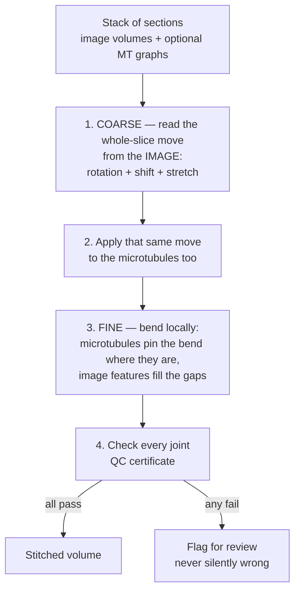

<p align="center">
  
</p>

# How the stitcher works — a plain-language tour

A short walkthrough you can hand to a colleague, student, or reviewer who is
not a specialist. No math required. The dense reference (algorithms, file
paths, citations) lives in [`README.md`](README.md) next door.

---

## The problem in one picture

A biological sample is often too thick to image at high resolution in one go.
So we **slice it** into thin sections, image each one in the microscope, and
then need to **glue them back** into a single 3D volume:

```
            REAL SAMPLE                      WHAT THE MICROSCOPE GIVES US

           ┌──────────┐                       ┌──────────┐  ← section 4
           │          │                       └──────────┘
           │          │                       ┌──────────┐  ← section 3
           │          │      →  cut  →        └──────────┘
           │          │                       ┌──────────┐  ← section 2
           │          │                       └──────────┘
           └──────────┘                       ┌──────────┐  ← section 1
                                              └──────────┘
                                              (each one rotated,
                                               shifted, and DISTORTED
                                               during prep — we don't
                                               know how)
```

The stitcher's job: figure out how each section was placed and deformed,
reverse it, and paste them all into one consistent volume.

---

## Two kinds of distortion → two stages

The key to the whole tool is realising that a cut section is messed up in
**two very different ways**, and each one needs a different fix.

**1. A global squish — from the knife.** As the diamond knife shaves off each
slice, it squashes the slice in the direction it is cutting — like a rolling
pin pushing dough: a little shorter along the roll, a little wider across.
Every part of the slice gets the *same* squash, so it is a **single
whole-slice stretch** (and it can stretch differently along x than along y —
that is what "anisotropic" means).

**2. A local, uneven shrink — from baking.** Before we image it, we "bake" the
slice under the electron beam so it stops moving — the beam shrinks the
plastic to stabilise it. But it does **not** shrink evenly: dense regions pull
in more, sparse regions less, so the slice ends up puckered — some spots
tugged in, others bulging out. Like a sheet of shrink-wrap heated unevenly. No
single stretch can describe that; it is **different in every spot**.

```
     GLOBAL squish (knife)              LOCAL uneven shrink (baking)
     same everywhere                    different in every spot

     ┌──────────────┐                   ┌──────────────┐
     │  ↘        ↙  │                   │   →   ←   ↗  │
     │      ↓↓      │   one stretch     │  ↖    ·    ↘ │   a different
     │      ↓↓      │   for the whole   │     ↗   ←    │   nudge at
     │  ↗        ↖  │   slice           │  ↙    →   ↖  │   each point
     └──────────────┘                   └──────────────┘
        → COARSE stage                     → FINE stage
```

So we undo them in two stages:

- **COARSE** — one big whole-slice move (rotate + shift + stretch) that gets
  the slices roughly on top of each other and undoes the knife squish.
- **FINE** — a gentle, spot-by-spot bend that undoes the uneven baking pucker.

And the two stages use **two different sources of evidence**, each suited to
its job:

- The **image** shows the whole slice at once, so it is the natural way to
  judge the big coarse move — including the knife squish, which is the same
  everywhere and easy to read from the overall picture.
- The **microtubules** (tiny tube-shaped fibres scattered densely through the
  cell) are the natural way to pin down the uneven local bend — they act like
  thousands of tiny survey markers, each saying "*this exact spot* moved
  here." Where there are no microtubules (often the corners), we fall back to
  matching the image content itself.

---

## The pipeline at a glance



Here is what each stage actually does, why it matters, and what could go
wrong if you skip it.

---

## Stage 1 — Coarse: line up the whole slice from the image

For each cut we compare the **bottom face of the upper section** with the
**top face of the lower section** — two pictures that, if the prep had been
perfect, would be identical. We read three things off them:

**Rotation.** We spin one image over every angle from 0° to 360° and, at each
angle, count how many small image patches find a confident partner on the
other face. The right angle has the most agreeing patches.

```
       angle = 0°     angle = 45°     angle = 90°    ...   angle = 130°
       ──────────     ──────────      ──────────           ──────────
        few patches    some patches    few patches          MOST patches
        agree          agree           agree                agree  ✓
```

Why brute-force every angle? A common shortcut reads the rotation from the
overall *shape* of the slice. But many slices are round-ish or symmetric, and
then the shape shortcut gives the wrong answer or none at all. Sweeping every
angle is slower but never gets fooled by symmetry.

This also settles the **upside-down question** for free. A symmetric slice
turned 180° looks almost the same — the classic ambiguity — but a *wrong*
flip leaves only a handful of patches agreeing, so it simply loses the count.

```
   These two are near-mirror images...    ...but the wrong flip leaves
                                            far fewer patches matching,
   ●   ●   ●          ●   ●   ●             so it loses on the count.
     ●   ●      vs.     ●   ●               When the two are a true
   ●   ●   ●          ●   ●   ●             tie, we ABSTAIN (below).
```

When two angles genuinely tie (a nearly round slice with no strong cue), we
compare the images one more way over a fixed central disk, cross-check against
the traced **outline** of the slice — and if it is still a coin-flip, we
**ABSTAIN**: the interface is flagged for review rather than guessed at.
(Silently picking the wrong flip ruins the whole volume downstream.)

**Shift.** The same patch-matching that scored the rotation also tells us how
far the slice slid sideways. If too few patches agree (a featureless or
badly-decorrelated face), we drop the shift to zero and flag the interface
rather than inject a noisy guess.

**Stretch (the knife squish).** Once the rotation is locked, we measure how
much the slice was stretched — and crucially, **independently along x and y**
(it can be squished more one way than the other). A plain "zoom" number cannot
capture that, so we keep the full stretch. This is the part that undoes the
knife compression.

**Then — and this is the whole point — we apply this one coarse move to the
microtubules too.** Both the image and the fibres now sit in the same
roughly-aligned frame, so the fine stage can start from there.

**When the image gets it wrong — the microtubules can rescue it.** On a hard
interface (a near-round slice with no clear outline) the image can occasionally
read the rotation badly wrong. The fibres are the safety net: when the matched
fraction collapses — the tell-tale of a wrong coarse move — the tool re-estimates
the rotation *and* the x/y stretch straight from the dense microtubule stubs, and
adopts that only when it clearly matches better. So a single bad image reading
does not sink the interface; the fibres correct it.

---

## Stage 2 — Fine: bend locally to undo the uneven shrink

The coarse move gets the slices close, but the uneven baking pucker remains.
To close it we need a *local* fix, and microtubules are the survey markers
that drive it.

**Pair the cut-ends.** Every microtubule that crossed the cut leaves a **stub
on each side**. The stub on the top of section N is the same fibre as a stub
on the bottom of section N+1:

```
   section N+1   ──────────────────
                       ▲  ▲  ▲     ← MT stubs on the bottom face
                       │  │  │
                  ─ ─ ─│─ ─│─ ─│─ ─    ← (the slice cut)
                       │  │  │
                       ▼  ▼  ▼     ← matching stubs on the top face
   section N     ──────────────────
```

We pair them with **Hungarian matching** — the math version of seating dinner
guests so every guest gets exactly one chair and the total closeness is best.
Two details make it reliable: distances are measured in **ρ units** (the
typical spacing between fibres, so the same code works at any voxel size), and
each stub's **pointing direction** counts too (two stubs that are close but
aim different ways are probably not the same fibre). Obvious mismatched pairs
are then thrown out before they can poison the bend.

**Bend to fit — safely.** The matched stub pairs say "this point should move
to there." We honour them with a **thin-plate spline** (TPS) warp: imagine
pressing a thin metal sheet onto a grid of pins — it bends just enough to
touch every pin while staying as flat as possible everywhere else. The pins
are our stub pairs.

This is powerful but **dangerous**: a bad set of pins can fold the sheet over
itself or spin it into a whirlpool — both physically impossible (cells do not
pass through themselves). So we **guard** every bend:

```
   ✗ FOLD (forbidden)         ✗ WHIRLPOOL (forbidden)        ✓ SAFE BEND

     ░░░░░░░░░                  ░░░    ░░░                     ░░░░░░░░░
     ░░░░░░░░░                  ░░░ ↻↻ ░░░                     ░░░▒▒▒░░░
     ▼▼ FOLDS BACK ▲▲           ░░░    ░░░                     ░░░░░░░░░
```

In plain terms: no area may collapse or turn inside-out, and no region may
swirl. If a bend breaks either rule we smooth it more and re-fit; if nothing
makes it safe, the bend is **rejected** and that spot just keeps the coarse
alignment — a bad warp is never applied.

**Fill the gaps with image features.** Microtubules do not cover the whole
slice — the corners are often empty, and that is exactly where features like
mitochondria or dark vesicles were seen to *jump* between sections. So in the
MT-free regions we match the **image content** directly and fold those matches
into the *same* bend, so the corners are pinned too:

```
        WHERE THE MICROTUBULES ARE          WHAT FILLS THE REST

       ┌───────────────────┐               ┌───────────────────┐
       │ .  .   corner   . │               │ ▣  ▣   image    ▣ │
       │   . ███████████ . │               │ ▣  ███████████  ▣ │  ▣ = image
       │ .   ███ MTs ███   │   +   ───►     │    ███ MTs ███    │      feature
       │   . ███████████ . │               │ ▣  ███████████  ▣ │      match
       │ .  .   corner   . │               │ ▣  ▣   (corners) ▣│
       └───────────────────┘               └───────────────────┘
       (MTs only pin the middle)           (image pins the corners)
```

The two sets of matches — fibre stubs and image features — feed one guarded
bend per interface, so the whole slice lines up, middle and corners alike.

---

## Stage 4 — Check every joint (the QC certificate)

Every section-to-section joint gets a small report card:

- How many microtubule stubs found partners (out of how many tried)?
- Was the bend safe, or did we have to reject it?
- Did the coarse rotation look confident, or was it a near-tie we had to
  flag?

A joint is **accepted only if every check passes**. Otherwise it is flagged
with the reason, and the end-of-run log tells you exactly which joints are
confident and which need a human look. This is the most important design
choice of the whole tool: **it would rather flag uncertainty than silently
produce a wrong stack.**

**One subtlety worth knowing: connecting is judged separately from bending.**
Whether two sections are *joined* (their microtubule networks linked) depends on
whether the fibre stubs matched cleanly — not on whether the local bend passed.
So if the stubs pair up well but the bend comes out too twisty to apply safely,
the sections are still joined and that spot simply keeps the coarse alignment
(no bend there). A rejected bend never blocks a good connection — and a clean
connection never forces a bad bend onto the volume.

A natural cross-check falls out of the design for free: if the coarse
rotation were wrong, the microtubule stubs would not pair up in the fine
stage — so a **low match fraction is itself a warning** that the coarse move
needs a human look.

---

## What if some sections have no microtubules?

Almost nothing changes — because the coarse stage was image-driven all along.
On a stack with no microtubule graphs, we run the same coarse step (rotation,
shift, stretch, all from the image) and then skip straight to the
**image-feature** fill for the local bend. The microtubules, when present, are
a bonus that makes the *fine* step sharper; they are no longer required to get
a result.

The one honest caveat: on a very round, featureless slice the image has little
to lock onto, so the rotation can be uncertain — and there the tool flags the
interface rather than guess. Microtubules, when you have them, are the best
cure for exactly that case.

---

## Tuning the export — three knobs that change wall time

The stitching math is the same regardless of settings, but the final step
(warping every input voxel into the output canvas) can be sped up by an
order of magnitude on a real-size dataset. Three knobs, each safe to leave
at its default:

### 1. Coarse warp grid — `warp_coarse_px`

The local bend is **smooth by construction** — neighbouring pixels get almost
the same nudge. So instead of asking "where does *each output pixel* come
from?" once per pixel (slow), we ask it on a coarse grid and fill in the gaps
by linear interpolation:

```
   FULL evaluation                COARSE + interpolate
   (one ? per pixel)              (one ? per 8 px, then interp.)

   ? ? ? ? ? ? ? ?                ?               ?
   ? ? ? ? ? ? ? ?
   ? ? ? ? ? ? ? ?                ?               ?
   ? ? ? ? ? ? ? ?                (4 questions, not 64)
```

Default is 8 px — the error you get back is sub-pixel, invisible at typical EM
contrast. Set `warp_coarse_px=0` for the full per-pixel evaluation.

### 2. Auto GPU chunk size — `gpu_chunk`

On the GPU the warp runs a few Z-slices at a time so the device never holds
the whole multi-GB volume at once. Default `None` asks the card how much
memory is free and picks a chunk that uses about half of it — so a 24 GB card
gets a bigger chunk than an 8 GB card, automatically. (Apple's MPS cannot
report free memory, so it uses a small, safe chunk.) Pass an integer to
override.

### 3. Trim canvas to the microtubules — `trim_to_mts`

When sections drift apart over a long stack, the box that fits *every*
section's corners is much larger than the region that actually contains
microtubules — most of the output is empty corners.

```
       FULL CORNER BBOX                  TRIM TO MTs (with padding)

       ┌───────────────────┐
       │ . . . . . . . . . │                 ┌───────────┐
       │ . . . ███████ . . │                 │  ███████  │
       │ . . ███████████ . │                 │ ██████████│
       │ . . . ███████ . . │                 │  ███████  │
       │ . . . . . . . . . │                 └───────────┘
       └───────────────────┘
       (most pixels are empty)           (only the MT-containing area)
```

Turning this on makes the warp work on the smaller canvas — proportional
savings in warp time and disk size. It is **opt-in** because sections without
any microtubules would have their content cropped out.

---

## Summary in one paragraph

A cut section is distorted two ways: a **global squish** from the knife (the
same everywhere) and an **uneven local pucker** from beam baking (different in
every spot). So the stitcher works in two stages. The **coarse** stage reads
one whole-slice move — rotation, shift, and an independent x/y **stretch** —
straight from the **image** (brute-force angle search, so symmetry never fools
it; ABSTAIN when even that is unsure), and applies that same move to the
microtubules. The **fine** stage then bends locally to undo the pucker:
**microtubule cut-ends** pin the bend wherever fibres exist (paired with
direction-aware Hungarian matching), **image features** pin the empty corners,
and the whole bend is guarded so it can never fold or swirl. Every joint gets
a confidence report card, and joints the tool is not sure about are flagged —
never silently stitched. When no microtubules are present, the same coarse
step runs and the fine bend relies on image features alone.

---

## Glossary

- **Section** — one physical slice of the sample, imaged as its own small
  3D tomogram.
- **Tomogram** — the 3D image of one section, reconstructed from many 2D
  views in the microscope.
- **Coarse stage** — the first, whole-slice alignment (rotation + shift +
  stretch), read from the image and applied to image and microtubules alike.
- **Fine stage** — the second, local bend that undoes the uneven baking
  pucker, driven by microtubules and image features.
- **Knife compression** — the global, one-direction squish the diamond knife
  puts on every slice as it cuts. Undone by the coarse stretch.
- **Baking** — the electron beam shrinking the plastic to stabilise it;
  uneven, so it puckers the slice. Undone by the fine bend.
- **Anisotropic stretch** — a stretch that differs along x and y (not a single
  uniform zoom). The coarse stage measures both, so the knife squish is
  captured correctly.
- **Microtubule (MT)** — a long, narrow tube-shaped fibre in the cell.
  Crosses section cuts, leaving stubs on both sides.
- **Stub / endpoint** — where a microtubule meets the cut face of a section.
  The fine-alignment signal lives here.
- **Interface** — the cut between two neighbouring sections. There are
  (n − 1) interfaces in a stack of n sections.
- **ρ (rho)** — the typical spacing between microtubules in a section. Used as
  a ruler so the same code works at any voxel size without retuning.
- **Hungarian matching** — a classical algorithm that finds the best
  one-to-one pairing between two sets, minimizing total cost.
- **TPS warp** — Thin-Plate Spline. A smoothly bending transform that honours
  a set of landmark pairs while staying as flat as possible.
- **Image-fill** — matching the image content directly in microtubule-free
  regions (e.g. corners) so they are pinned into the same fine bend.
- **Diffeomorphism** — a warp that does not fold or tear. The two safety
  checks (no inversion, no swirl) together guarantee it.
- **ABSTAIN** — the tool's policy of flagging an interface as "I don't know"
  rather than guessing, when no check is confident enough.
- **QC certificate** — the per-interface report card that summarises every
  check; used to accept or flag each joint.
