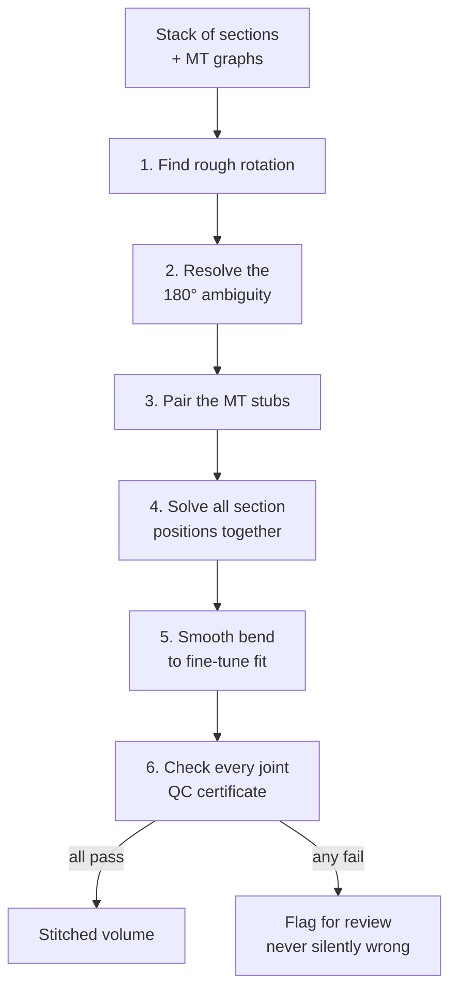

<p align="center">
  
</p>

# How the stitcher works — a plain-language tour

A short walkthrough you can hand to a colleague, student, or reviewer who is
not a specialist. No math required. The dense reference (algorithms, file
paths, citations) lives in [`README.md`](README.md) next door.

---

## The problem in one picture

A biological sample is often too thick to image at high resolution in one go.
So we **slice it** into thin sections, image each one in the microscope, and
then need to **glue them back** into a single 3D volume:

```
            REAL SAMPLE                      WHAT THE MICROSCOPE GIVES US

           ┌──────────┐                       ┌──────────┐  ← section 4
           │          │                       └──────────┘
           │          │                       ┌──────────┐  ← section 3
           │          │      →  cut  →        └──────────┘
           │          │                       ┌──────────┐  ← section 2
           │          │                       └──────────┘
           └──────────┘                       ┌──────────┐  ← section 1
                                              └──────────┘
                                              (each one rotated,
                                               shifted, maybe flipped
                                               during prep — we don't
                                               know how)
```

The stitcher's job: figure out how each section was placed (rotation, shift,
small bending), reverse it, and paste them all into one consistent volume.

---

## The trick: use microtubules as bridges

Microtubules (MTs) are tiny tube-shaped fibers that run through the cell.
When the sample is cut, every MT that crossed the cut gets sliced — leaving a
**stub on each side**. The stub on the top of section N should be the same
fiber as the stub on the bottom of section N+1:

```
   section N+1   ──────────────────
                       ▲  ▲  ▲     ← MT stubs on the bottom face
                       │  │  │
                  ─ ─ ─│─ ─│─ ─│─ ─    ← (the slice cut)
                       │  │  │
                       ▼  ▼  ▼     ← matching stubs on the top face
   section N     ──────────────────
```

If we can **pair up** the stubs across each cut, we learn how the two
sections fit together. Those pairs are the alignment signal.

(When MTs are missing, there is an image-only fallback — see the last section.)

---

## The pipeline at a glance



Each phase has a tricky part. Here is what each one actually does, why it
matters, and what could go wrong if you skip it.

---

## Phase 1 — Find the rotation

For each cut, we ask: **by how many degrees do I need to spin section N+1 so
its stubs line up with section N's?**

The simple version: try every angle from 0° to 360°, and at each angle count
how many stubs find a partner. The angle with the most matches is the answer.

```
       angle = 0°     angle = 45°    angle = 90°     ...   angle = 130°
       ──────────    ──────────     ──────────            ──────────
       ▲ ▲   ▲  ▲      ▲▲▲▲           ▲   ▲                 ▲▲▲▲▲▲▲
       ?  ? ? ? ?      ? ? ? ?        ?  ? ? ?              ✓ ✓ ✓ ✓
       ▼ ▼ ▼ ▼ ▼       ▼  ▼ ▼ ▼       ▼  ▼ ▼ ▼              ▼ ▼ ▼ ▼
       (few match)    (some match)   (few match)            (most match!)
```

Why brute-force? A common shortcut is to estimate rotation from the local
shape of the point cloud (called PCA). But if the cloud is symmetric — for
example a bundle of parallel fibers — PCA gives the wrong answer or no answer
at all. Sweeping every angle is slower but never gets fooled by symmetry.

We also run a second matcher called **CPD** (Coherent Point Drift). Think of
it as a soft magnet that pulls one set of stubs onto the other from
several starting positions and reports which alignment "feels" most stable.
It is good at finding rotations up to ±90° from a cold start.

---

## Phase 2 — Resolve the 180° flip

Even after the right *angle* is found, a symmetric pattern still has a
problem: turning it upside down looks identical. The math literally cannot
tell which way is up.

```
   These two arrangements                   ...look the same to a
   are mirror images:                       point-matcher:

   ●   ●   ●                                ●   ●   ●
     ●   ●           vs.   ●   ●               ●   ●
   ●   ●   ●               ●   ●   ●         ●   ●   ●

   (flipped 180°)
```

To break the tie we use **biology**, not more math. Most specimens have a
real top-vs-bottom — for example a sperm cell has a head end (anterior) and
a tail end (posterior). This shows up as a slight density asymmetry that is
visible in every section. We measure the asymmetry, agree on a "this way is
the head end" rule for the whole stack, and use that to pick which of the
two flips is the real one.

**If even biology cannot decide, we ABSTAIN.** The interface is flagged for
review rather than guessed at. (Silently picking the wrong flip ruins the
whole volume downstream — flagging is much better than guessing.)

---

## Phase 3 — Pair the MT stubs

Once two sections are roughly aligned, we need to say *which* stub on top is
the same fiber as *which* stub below. We use a classical algorithm called
**Hungarian matching**, which is the math version of seating guests at a
dinner: every guest gets exactly one chair, every chair gets exactly one
guest, and the total "happiness" (here: closeness of the pairs) is
maximized.

Two extras matter here:

1. **Distance is measured in `ρ` units, not pixels.** `ρ` is the typical
   spacing between MTs in that section — so "close" automatically rescales
   with the voxel size. The pipeline behaves the same on a 4 nm dataset as on
   a 16 nm one, without retuning thresholds.

2. **Direction also counts.** Each stub has a direction (the fiber's tangent
   at the cut). Two stubs that are physically close but pointing different
   ways probably are *not* the same fiber. Including direction in the cost
   makes the pairing much more reliable.

After the pairing, we **throw out obvious outliers** — pairs that are wildly
inconsistent with the rest of the pairs in that interface. Outliers are
usually pairs of unrelated fibers that just happened to be close, and they
poison the fine-fitting step that follows.

---

## Phase 4 — Solve all section positions together

The naive way to stack sections is to align 1 to 2, then 2 to 3, then 3 to
4, and so on. This is called **greedy chaining**. The problem: every joint
adds a tiny error, and those errors accumulate. The worst kind is **scale
drift** — if every step shrinks by 1 %, the top of the stack is 30 % smaller
than the bottom after 30 sections.

```
                  GREEDY                     GLOBAL SOLVE
                  ──────                     ────────────

      section 5  ▒▒▒▒    ← way off          ████   ← all consistent
      section 4  ████              ────►    ████
      section 3  ████                       ████
      section 2  ████                       ████
      section 1  ████                       ████
```

Instead we solve every section's position **at once**, asking: what set of
positions makes *all* the joint matches as good as possible together? We
also tell the solver "all sections should be roughly the same size" and
"neighboring sections should have similar rotation" — gentle nudges that
beat greedy chaining badly on long stacks.

---

## Phase 5 — Smooth bend to fine-tune the fit

Even after the best rigid alignment (rotation + shift + uniform scale), the
cuts will not line up perfectly — real tissue distorts a little during
section preparation. To close the residual gap we apply a **thin-plate
spline** (TPS) warp. The mental picture: imagine pressing a thin sheet of
metal down on a grid of pins. The sheet bends just enough to touch every
pin, while staying as flat as possible everywhere else. That is the TPS
warp, in 2D, where the "pins" are our MT-stub pairs.

This is powerful but **dangerous**: a TPS warp can fold the image over
itself or create swirling whirlpools if the input pairs are bad. A folded or
swirled image is physically impossible — cells do not pass through themselves
— so we **guard** every warp with two checks:

```
   ✗ FOLD (forbidden)         ✗ WHIRLPOOL (forbidden)         ✓ SAFE BEND
                                                                
     ░░░░░░░░░                  ░░░    ░░░                      ░░░░░░░░░
     ░░░░░░░░░                  ░░░ ↻↻ ░░░                      ░░░▒▒▒░░░
     ░░░░░░░░░                  ░░░ ↻↻ ░░░                      ░░░░░░░░░
     ▼▼▼ FOLDS BACK ▲▲▲         ░░░    ░░░                      
     ░░░░░░░░░                                                  
```

In plain terms the two checks say:

- **No area can collapse to zero or flip inside-out.** (The math term is
  "Jacobian determinant must stay positive" — but you can think of it as
  "no shape can implode or invert".)
- **No part of the image can spin around like a vortex.** (The math term
  is "bounded curl".)

If a warp violates either check, the smoothing is increased and it is
re-fit. If no amount of smoothing makes it safe, the warp is **rejected**
entirely — a bad warp is never applied, the rigid fit is used instead.

---

## Phase 6 — Check every joint (the QC certificate)

Every section-to-section joint gets a small report card:

- How many MT stubs found partners (out of how many tried)?
- Was the warp safe, or did we have to reject it?
- **Independent image check:** apply the proposed rotation to the actual
  image of the section's top face and ask "does it now look like the bottom
  face of the section above it?". This uses image content the matcher never
  saw, so it is a true second opinion.

A joint is **accepted only if every check passes**. Otherwise it is
flagged with the reason. The end-of-run log tells you exactly which joints
are confident and which need a human look. This is the most important design
choice of the whole tool: **it would rather flag uncertainty than silently
produce a wrong stack.**

---

## What if some sections have no microtubules?

Not every dataset has MT graphs. For those, the rotation comes from cell
**geometry** instead of MT stubs:

1. **Magnitude from the nuclear envelope.** The nucleus is roughly the
   same shape on neighbouring sections, just rotated. We trace its outline
   on each face and ask "how much do I need to spin one outline so it
   matches the other?".

2. **Sign from the organelle constellation.** Once the magnitude is fixed,
   we still have the same 180° flip ambiguity. The arrangement of
   mitochondria and other dense organelles is asymmetric enough to vote on
   which way is "up vs down".

3. **When the vote is weak (round-ish faces), the interface is flagged for
   review** — same ABSTAIN principle as the MT path.

Translation between sections is then a normal image-block search, exactly
like the MT path but driven by pixels instead of stubs.

---

## Tuning the export — three knobs that change wall time

The stitching math is the same regardless of settings, but the final step
(warping every input voxel into the output canvas) can be sped up by an
order of magnitude on a real-size dataset. Three knobs, each safe to leave
at its default:

### 1. Coarse warp grid — `warp_coarse_px`

The smooth bend (TPS) is **smooth by construction** — neighbouring pixels
get almost the same displacement. So instead of asking "where does *each
output pixel* come from?" once per pixel (slow), we ask it on a coarse grid
and fill in the gaps by linear interpolation:

```
   FULL evaluation                COARSE + interpolate
   (one ? per pixel)              (one ? per 8 px, then interp.)

   ? ? ? ? ? ? ? ?                ?               ?
   ? ? ? ? ? ? ? ?                
   ? ? ? ? ? ? ? ?                
   ? ? ? ? ? ? ? ?                                
   ? ? ? ? ? ? ? ?                ?               ?
                                  (4 questions, not 64)
```

Default is 8 px. A smooth bend changes by a fraction of a pixel over 8 px,
so the error you get back is sub-pixel — invisible at typical EM contrast.
Set `warp_coarse_px=0` to fall back to the full per-pixel evaluation if you
ever need to compare.

### 2. Auto GPU chunk size — `gpu_chunk`

On the GPU, the warp is run a few Z-slices at a time so the device never has
to hold the whole multi-GB volume in memory. The "few" is the chunk size.
Too small wastes throughput; too big risks an out-of-memory crash.

Default `None` asks CUDA how much memory is free and picks a chunk that uses
about half of it — so a 24 GB card gets a bigger chunk than a 8 GB card,
automatically. (Apple's MPS has no free-memory query, so it conservatively
uses a small chunk.) Set an integer to override if you know better.

### 3. Trim canvas to the microtubules — `trim_to_mts`

When sections drift apart over a long stack, the bounding box that fits
*every* section's corners is much larger than the region that actually
contains microtubules. Most of the output canvas is empty corners.

```
       FULL CORNER BBOX                  TRIM TO MTs (with padding)

       ┌───────────────────┐             
       │ . . . . . . . . . │             
       │ . . . . . . . . . │                 ┌───────────┐
       │ . . . ███████ . . │                 │  ███████  │
       │ . . ███████████ . │                 │ ██████████│
       │ . . . ███████ . . │                 │  ███████  │
       │ . . . . . . . . . │                 └───────────┘
       │ . . . . . . . . . │             
       └───────────────────┘             
       (most pixels are empty)           (only the MT-containing area)
```

Turning this on (`trim_to_mts=True`) makes the warp work on the smaller
canvas — proportional savings in both warp time and disk size. It is
**opt-in** because if you have sections without any microtubules, their
content would be cropped out.

---

## Summary in one paragraph

The stitcher pairs **microtubule cut-ends** across each section interface to
recover the rotation and shift that brings the sections back together. It
**brute-force searches** for the right angle (so symmetric bundles do not
fool it), uses **cell polarity** to resolve the upside-down ambiguity (and
refuses to commit when even that is unclear), pairs the cut-ends with
**Hungarian matching** including direction, **solves every section's
position at once** so errors do not compound, and then applies a **smoothly
bent warp** that is guarded against folds and whirlpools. Every joint gets
an independent image-based confidence check. When no MTs are available, the
shape of the **nuclear envelope** and the constellation of **organelles**
play the same role. Joints the tool is not sure about are flagged, never
silently stitched.

---

## Glossary

- **Section** — one physical slice of the sample, imaged as its own small
  3D tomogram.
- **Tomogram** — the 3D image of one section reconstructed from many 2D
  views in the microscope.
- **Microtubule (MT)** — a long, narrow tube-shaped fiber in the cell.
  Crosses section cuts, leaves stubs on both sides.
- **MT graph** — the digitized centerline of all microtubules in a section,
  stored as a list of points along each fiber.
- **Stub / endpoint** — where an MT meets the cut face of a section. The
  alignment signal lives here.
- **Interface** — the cut between two neighbouring sections. There are
  (n − 1) interfaces in a stack of n sections.
- **ρ (rho)** — the typical spacing between MTs in a section. Used as a
  ruler so the same code works on any voxel size without retuning.
- **Hungarian matching** — a classical algorithm that finds the best
  one-to-one pairing between two equal-size sets, minimizing total cost.
- **CPD (Coherent Point Drift)** — a probabilistic point-cloud aligner that
  treats one cloud as "soft magnets" pulling on the other.
- **PCA** — Principal Component Analysis. A quick way to read the dominant
  axis of a point cloud; fails when the cloud is symmetric.
- **A–P polarity** — anterior–posterior. The biological "head vs tail" axis
  of the specimen; used to break the 180° flip ambiguity.
- **TPS warp** — Thin-Plate Spline. A smoothly bending transform that
  honours a set of landmark pairs while staying as flat as possible.
- **Diffeomorphism** — a warp that does not fold or tear. The two safety
  checks (no inversion, no swirl) together guarantee diffeomorphism.
- **ABSTAIN** — the tool's policy of flagging an interface as "I don't
  know" rather than guessing, when no check is confident enough.
- **QC certificate** — the per-interface report card that summarises every
  check; used to accept or flag each joint.
